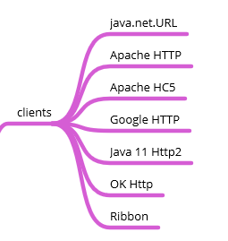
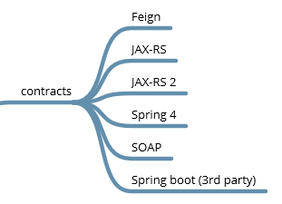
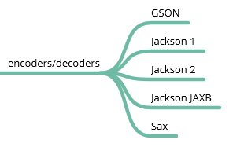

## OpenFeign
### Interfaccia annotata

```java
interface GitHub {

  @RequestLine("GET /repos/{owner}/{repo}/contributors")
  List<Contributor> contributors(
                    @Param("owner") String owner, 
                    @Param("repo") String repo);

  @RequestLine("POST /repos/{owner}/{repo}/issues")
  void createIssue(Issue issue, 
                    @Param("owner") String owner, 
                    @Param("repo") String repo);
}

// public static class Contributor { ... } 
// public static class Issue { ... }
```


## OpenFeign
### Il builder

```java
public class MyApp {

  public static void main(String... args) {

    GitHub github = Feign.builder()
             .decoder(new GsonDecoder())
             .target(GitHub.class, "https://api.github.com");
    
    List<Contributor> list = github.contributors("OpenFeign", "feign");
    for (Contributor c : list) {
      System.out.println(c.login + " (" + c.contributions + ")");
    }
  }
}
```


## Un minimo di storia
### Ma quanti "Feign" ci sono?

- Netflix OSS con nome **"Feign"** (fino a luglio 2016)
- Sviluppo trasferito alla community: **"OpenFeign"**
- **Spring Cloud Netflix Feign** <small>`org.springframework.cloud.netflix.feign`</small>
- **Spring Cloud OpenFeign** <small>`org.springframework.cloud.openfeign`</small>


## Clients
### "sotto il cofano" supportati



## Annotazioni
### i "contract" supportati



## Encoders/decoders



### Headers

Il token diventa parte dell'API
```java
@RequestLine("POST /")
@Headers("X-Ping: {token}")
void post(@Param("token") String token);
```

Supporto a header conosciuti solo a run-time
```java
@RequestLine("POST /")
void post(@HeaderMap Map<String, Object> headerMap);
```


### JAX-RS Contract
```java
interface GitHub {
  @GET @Path("/repos/{owner}/{repo}/contributors")
  List<Contributor> contributors(
        @PathParam("owner") String owner, 
        @PathParam("repo") String repo);
}

public class Example {
  public static void main(String[] args) {
    GitHub github = Feign.builder()
       .contract(new JAXRSContract())
       .target(GitHub.class, "https://api.github.com");
  }
}
```


### SOAP Encoder/Decoder

```java
Api api = Feign.builder()
	     .encoder(new SOAPEncoder(jaxbFactory))
	     .decoder(new SOAPDecoder(jaxbFactory))
	     .errorDecoder(new SOAPErrorDecoder())
	     .target(MyApi.class, "http://api");
```
- Generare le classi con wsimport, e utilizzarle
- Custom SOAPDecoder per servizi poco "SOAP"


### Logging

```java
GitHub github = Feign.builder()
     .logger(new Slf4jLogger())
     .logLevel(Level.FULL)
     .target(GitHub.class, "https://api.github.com");
```


### Error decoder

```java
Feign.builder()
    .errorDecoder((methodKey, response) -> {
           String details = IOUtils.toString(response.body().asInputStream(), 
                    StandardCharsets.UTF_8);
           return new ClientException(details);
    })
    .target(MyApi.class, "https://api.hostname.com");
```


### Retry

```java
Feign.builder()
     .retryer(new Retryer.Default(100, SECONDS.toMillis(1), 5))
     .target(MyApi.class, "https://api.hostname.com");
```


### A "real" feign instance 
```java
public interface MyService {
   //....
    @NoRetry
    @RequestLine("POST ")
    InsDocumentoResponse insDocumento(InsDocumento request);

    static MyService getInstance(Configuration config) {
        return Feign.builder()
        .errorDecoder(new CustomErrorDecoder())
        .options(new Request.Options(
                config.getInteger("myservice.connectTimeout", 1000),
                config.getInteger("myservice.readTimeout", 10000),
                false))
        .logger(new Slf4jLogger(MyService.class))
        .logLevel(config.getBoolean("myservice.fullLog", false) ? Logger.Level.FULL : Logger.Level.BASIC)
        .retryer(new AdvancedRetrier(IgnoreRetry.withAnnotationOn(MyService.class)))
        .target(MyService.class,
                config.getString("myservice.endpoint", "http://example.com/v1/api")
        );
}
```
