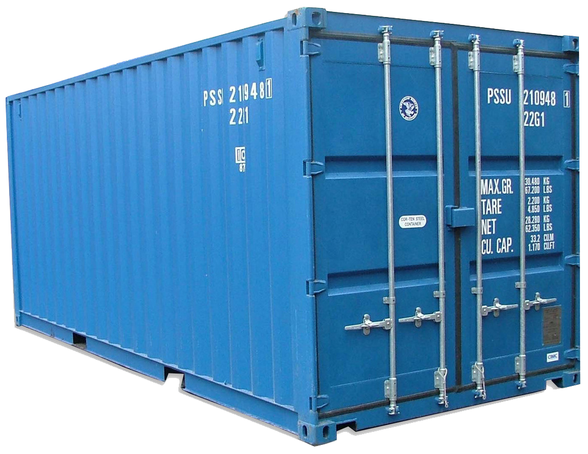
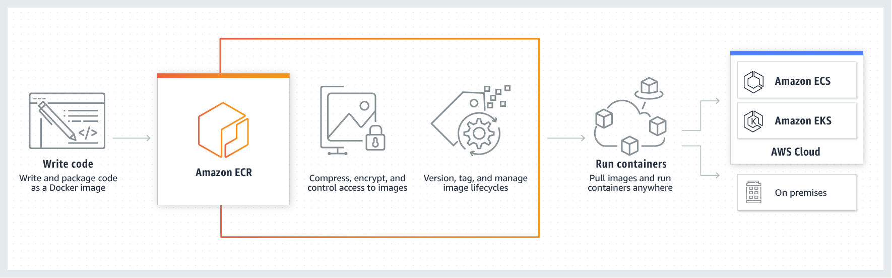

<table border="0">
 <tr>
    <td>
      
    </td>
    <td>
      
    </td>
    <td>
      
    </td>
 </tr>
 <tr>
    <td>Dockerfile</td>
    <td>Immagine</td>
    <td>Container</td>
 </tr>
</table>

