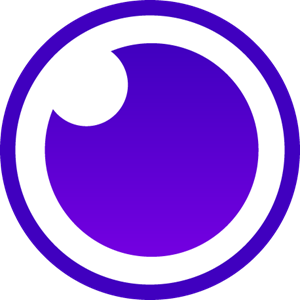

    
    INSOMNIA

## Interactive Section

* Creating new Document in Insomnia UI 
* Importing OpenAPI specification 
* REST requests using different environments
* [Mocha](https://mochajs.org/) Framework and [Chai](https://www.chaijs.com/api/bdd/) for Assertion
* Creation and execution of tests directly on the Insomnia UI
* Workflow/action on GitHub to perform defined tests (CI / CD)
* [Plugins](https://insomnia.rest/plugins)